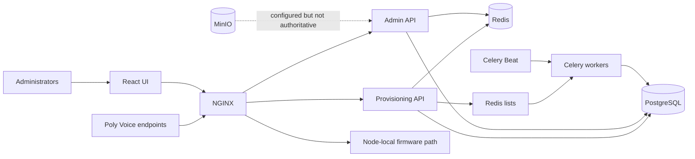
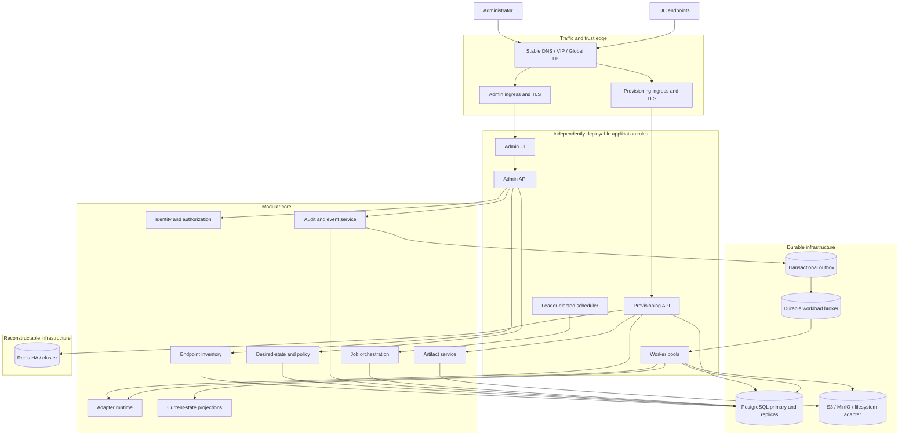
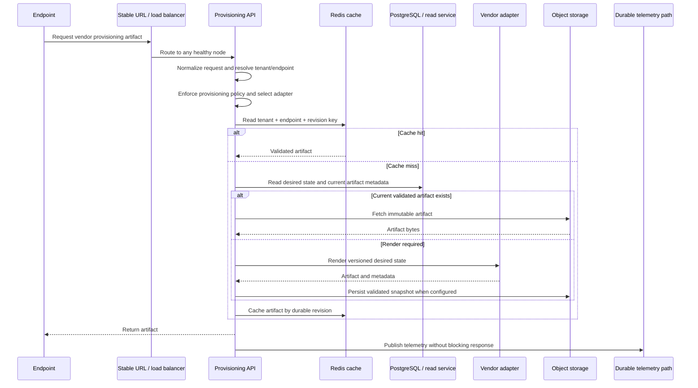
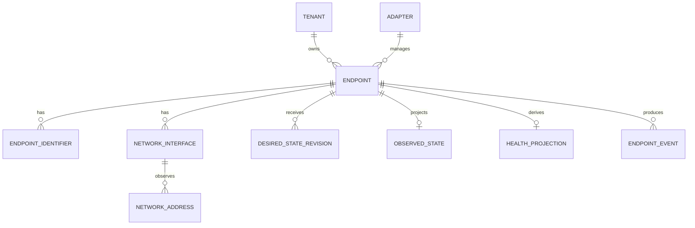
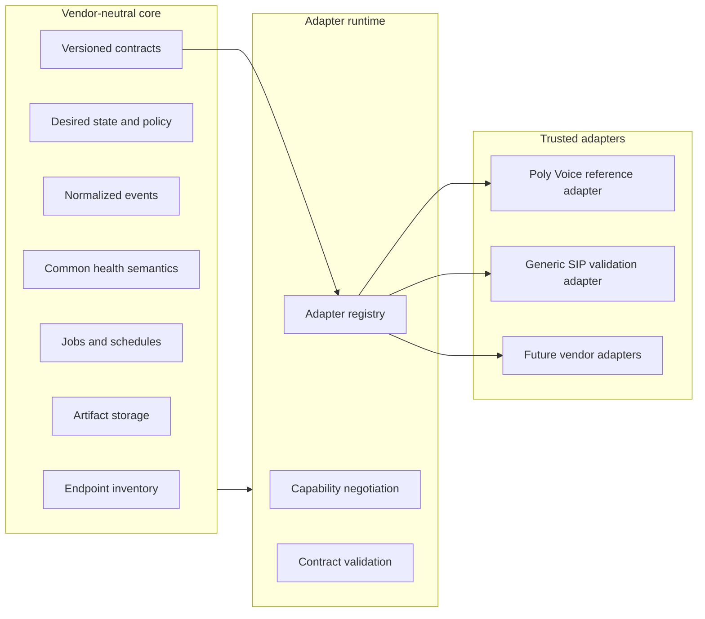
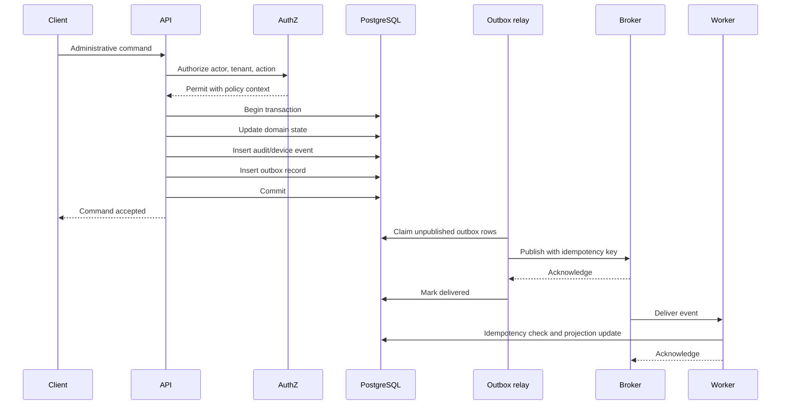
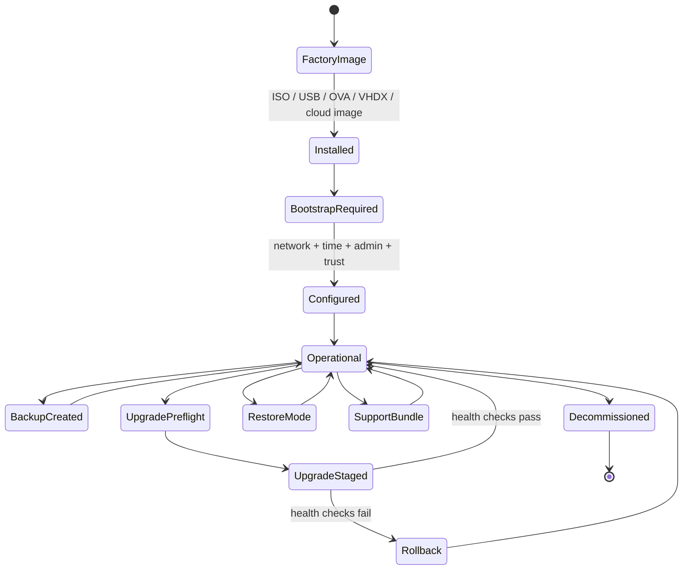
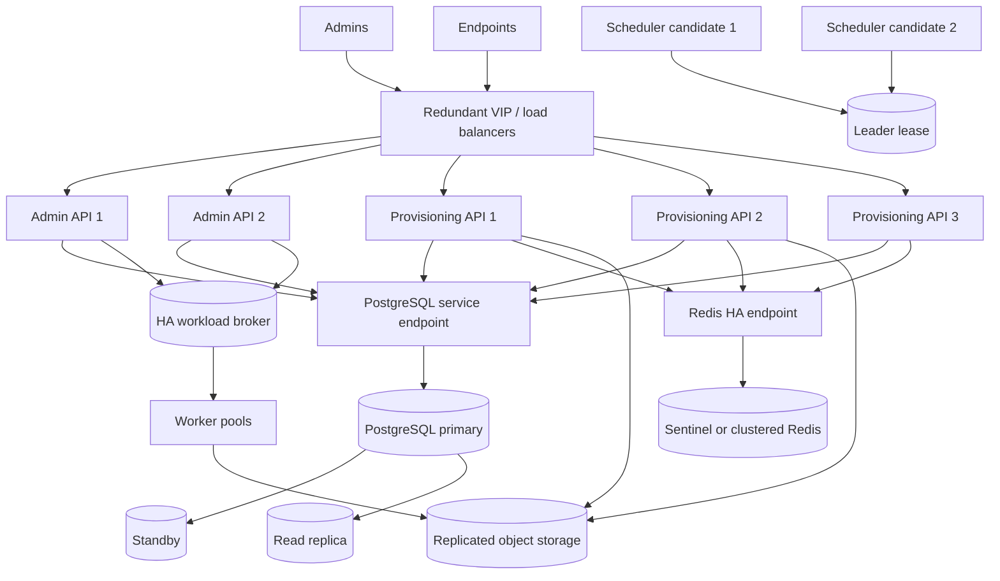
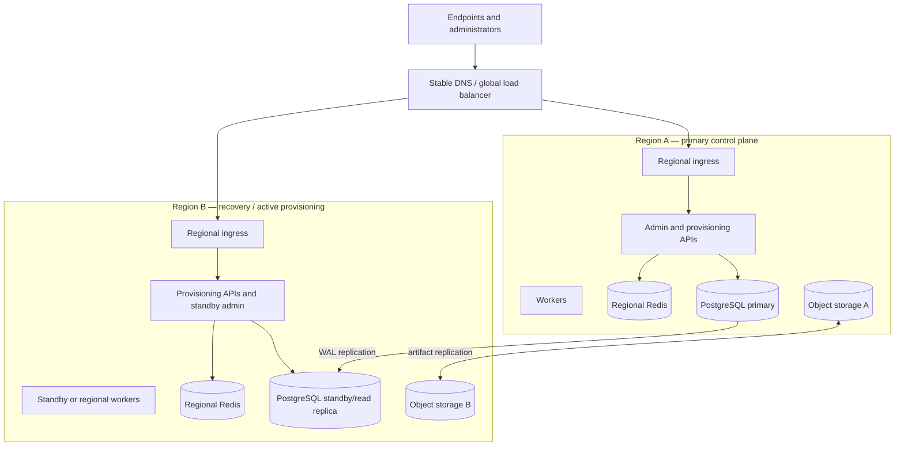

# OpenUC Manager Enterprise Architecture Blueprint

Version: **1.0**

Status: **Approved**

Date: **July 2026**

Owner: **Drew Stone**

Milestone: **Enterprise Foundation — EF-1**

This document is the authoritative target architecture for OpenUC Manager. Implementation details may evolve through approved Architecture Decision Records, but major design changes should remain consistent with this blueprint.

## Vision Statement

OpenUC Manager is an enterprise-grade Unified Communications Management Platform designed to securely provision, manage, monitor, and automate multi-vendor collaboration endpoints across on-premises, cloud, hybrid, and air-gapped environments. The platform is security-first, vendor-neutral, horizontally scalable, and appliance-friendly, enabling organizations to manage deployments ranging from small offices to global enterprises with hundreds of thousands of endpoints.

This blueprint supersedes prototype-era claims that OpenUC Manager is production-complete or enterprise multi-tenant. Existing provisioning functionality remains valuable, but future implementation should conform to this blueprint unless superseded by an approved Architecture Decision Record (ADR).

Normative language:

- **Must**: required for EF-1 or foundational correctness.
- **Should**: expected unless an ADR documents an alternative.
- **May**: optional or deployment-specific.
- **Deferred**: explicitly outside EF-1.

## 1. Executive summary

OpenUC Manager will become a secure, vendor-neutral control plane for enterprise Unified Communications endpoints.

The existing Poly Voice provisioning engine should be retained and evolved, not rewritten wholesale. Its strongest architectural choices—separate admin and provisioning roles, stateless APIs, cache-first provisioning, PostgreSQL as system of record, asynchronous workers, and API-first administration—are compatible with the new direction.

EF-1 must correct several prototype assumptions before feature expansion:

- Tenant IDs in records are not sufficient tenant isolation.
- A MAC address cannot remain the canonical endpoint identity.
- Vendor-specific behavior cannot remain embedded in core services.
- Redis cannot be the only durable copy of critical work.
- Node-local firmware cannot be the authoritative artifact store.
- An audit table without transactional writers is not an audit system.
- Replicas in a manifest do not constitute HA.
- Commented TLS examples do not constitute secure-by-default deployment.
- Appliance packaging without lifecycle management is not an appliance product.
- `create_all()` is not a production migration strategy.

The architectural unit should remain a **modular monolith with independently deployable roles**. Microservices are not an EF-1 goal.

## 2. Updated product mission and scope

### Mission

OpenUC Manager provides a locally controlled, secure, auditable, extensible management plane for enterprise UC endpoints across vendors, sites, tenants, security zones, and deployment environments.

### Core product responsibilities

- Endpoint inventory and identity.
- Tenant, site, group, and policy management.
- Provisioning and configuration lifecycle.
- Firmware and software lifecycle.
- Discovery and enrollment.
- Desired, observed, and derived health state.
- Administrative audit and endpoint history.
- Enterprise identity and authorization.
- Jobs, scheduling, rollout control, and failure recovery.
- Immutable artifact management.
- Reporting and automation APIs.
- Appliance installation and lifecycle operations.
- Backup, restoration, diagnostics, and support export.

### Non-goals for EF-1

- Universal UC protocol normalization.
- Arbitrary third-party code execution.
- Active/active multi-region database writes.
- Sophisticated tenant sharding.
- Fully autonomous remediation.
- A broad catalog of production adapters.

## 3. Architecture principles

1. **Secure by default.** Production profiles must fail closed when secrets, TLS, or bootstrap requirements are unsafe.
2. **Tenant isolation is a security boundary.** It must be enforced centrally, tested negatively, and applied to every tenant-owned record, event, query, job, object, and cache key.
3. **No node owns an endpoint.** Any healthy provisioning or worker node may serve or process any endpoint.
4. **PostgreSQL is the durable source of truth.** Redis and API-local state must be reconstructable.
5. **Vendor behavior belongs in adapters.** The core operates on normalized endpoint, policy, event, artifact, job, and health contracts.
6. **Stable platform identity precedes vendor identity.** MAC, serial, cloud ID, and room ID are identifiers attached to an endpoint, not the endpoint itself.
7. **Desired, observed, derived, and historical state are separate.**
8. **Events are contracts.** Event schemas must be versioned, attributable, tenant-aware, and retention-aware.
9. **Appliance operation is first-class.** Core operation must not require cloud connectivity or knowledge of internal containers.
10. **HA behavior is designed, not inferred.** Every component must have documented failure, retry, failover, and recovery semantics.
11. **Scale is empirical.** Capacity claims require reproducible tests under normal, cold-cache, failure, recovery, and upgrade conditions.
12. **Moderate foundational refactors are preferred now.** Prototype compatibility must not block material improvements to security, resilience, or neutrality.
13. **Microservices require justification.** Internal contracts come before additional network boundaries.
14. **Cloud services are adapters, not requirements.**
15. **Documentation and implementation must agree.**

## 4. Current-state architecture

The current implementation has separately selectable admin and provisioning roles, one PostgreSQL database, Redis for several unrelated functions, Celery workers, NGINX, and a React UI.



### Current strengths

- Independently selectable API planes.
- Cache-first provisioning and buffered telemetry.
- Distributed health claims using database row locking.
- Tenant, organization, RBAC, device, template, and firmware schema foundations.
- Metrics, health endpoints, structured logs, and non-root containers.
- Kubernetes examples with API replicas, HPA, and disruption budget.

### Current limitations

- Tenant enforcement is endpoint-specific rather than centralized.
- Poly behavior is embedded throughout the core.
- Audit persistence is absent.
- Migration history has no complete base schema.
- Critical Redis buffers use destructive pops.
- S3 configuration is not connected to artifact delivery.
- HTTPS is disabled by default.
- HA backing services and provisioning ingress are not implemented.
- The Helm chart is a skeleton.
- The appliance lifecycle does not yet exist.

## 5. Target-state logical architecture



Provisioning nodes remain interchangeable; critical mutations commit domain state, events, and outbox records in one transaction; Redis remains reconstructable; immutable artifacts use a storage interface; and adapters cannot access arbitrary core state.

## 6. Component boundaries

### Admin API

Owns tenant and organization management, endpoint inventory, desired-state policy, enrollment approval, jobs, artifact metadata, events, audit queries, and system configuration. It must not contain vendor rendering or probing logic.

### Provisioning API

Owns request normalization, endpoint and tenant resolution, provisioning authorization, adapter selection, cache/artifact lookup, controlled rendering, non-blocking telemetry, and last-known-good behavior. It must not expose admin routes or depend on process-local session state.



### Workers and scheduler

Worker pools should be separated into `events`, `provisioning`, `health`, `firmware`, `imports`, `maintenance`, and `system` workloads. The scheduler evaluates schedules but does not perform work; it must use leader election or durable leases. Duplicate evaluation must be safe through idempotency.

### Core modules

Recommended internal modules are `identity`, `authorization`, `tenancy`, `inventory`, `adapters`, `provisioning`, `desired_state`, `observed_state`, `health`, `events`, `audit`, `jobs`, `artifacts`, `certificates`, `appliance`, and `reporting`. Modules should collaborate through services and contracts rather than unrestricted table access.

## 7. Endpoint identity model

A stable platform endpoint ID becomes canonical. UUIDv7 is a reasonable default, subject to ADR approval.



Endpoint identifiers are typed and namespaced, including MAC, serial, vendor device ID, cloud ID, room/resource ID, and asset identifier. Uniqueness is normally tenant- and namespace-scoped; global uniqueness must not be assumed. Identity matching produces confidence and evidence. Merge and split operations are explicit, authorized, audited, and reversible.

Desired state is versioned operator/policy intent. Observed state is the latest normalized device observation. Derived state contains health, compliance, drift, and readiness projections. Historical events remain immutable. Existing MAC routes remain compatibility lookups, while `/endpoints/{endpoint_id}` becomes canonical.

## 8. Vendor adapter model



Contracts cover metadata/version, endpoint kinds, capabilities, identifier normalization, discovery, provisioning recognition, artifact naming/rendering, desired-state validation, firmware compatibility, probes, telemetry normalization, errors, and redaction.

For EF-1, adapters are trusted built-in modules. They receive validated contract objects, not unrestricted database sessions. Network access is explicit and policy-controlled. Poly Voice is the reference adapter; a narrow Generic SIP adapter validates neutrality. Arbitrary plugins and marketplace support are deferred.

## 9. Tenant isolation and authorization model

Replace the single `AdminUser.tenant_id` assumption with subjects, tenant memberships, scoped role bindings, permissions, and an authorization context carrying actor, tenant, resource scope, authentication strength, and request identity.

- Deny by default.
- Global administration is explicit, not represented by a null tenant.
- Policy Enforcement Points exist in APIs, workers, exports, event queries, and artifact access.
- A centralized Policy Decision Point evaluates access.
- Resource repositories require tenant context and reject unscoped access.
- PostgreSQL row-level security should provide defense in depth once application rules stabilize.
- Cache, object, job, and event keys include tenant context.
- Long-running jobs re-evaluate authorization as appropriate.

EF-1 negative tests must prove that one tenant cannot read, list, search, mutate, reference, export, schedule against, or view events and artifacts belonging to another tenant.

## 10. Audit and event architecture



The common envelope includes event ID, tenant/platform scope, endpoint, actor, authentication context, source, adapter/version, event type, occurred/recorded timestamps, correlation and causation IDs, structured payload, before/after data, schema/version, integrity metadata, classification, retention, redaction, and idempotency key.

Audit, lifecycle, provisioning, health, firmware, security, and system events may use separate tables or partitions, but share envelope contracts, authorization, correlation, integrity, retention, and export infrastructure. Audit is append-only to application roles. Tamper evidence, signed export batches, syslog over TLS, off-box object export, and legal hold must be supported or explicitly profiled.

## 11. Database and migration strategy

PostgreSQL remains authoritative for tenancy, authorization, identity, desired/observed state, jobs, leases, events, artifact metadata, outbox, idempotency, and appliance configuration.

- Shared schema with mandatory tenant IDs for tenant-owned data.
- Partitioned high-volume event tables.
- Real foreign keys instead of unchecked polymorphic references where integrity matters.
- Immutable revisions for rollback/audit-sensitive state.
- Optimistic concurrency for operator-managed resources.
- Complete baseline migration from an empty database.
- Automated upgrades from every supported release.
- Expand/migrate/contract sequencing and rolling-version compatibility.
- Migration preflight, locking, failure recovery, appliance checkpoints, and partition lifecycle management.

`Base.metadata.create_all()` must remain development/test-only. Replicas may serve declared-staleness reads; authorization and read-after-write paths must not depend on arbitrarily stale replicas.

## 12. Durable queue and worker architecture

A broker delivers work but is not the sole evidence that work exists. Critical work originates from PostgreSQL jobs/outbox records and can be republished.

Required semantics include at-least-once delivery, late acknowledgement, idempotent handlers, bounded classified retries, dead-letter storage, workload queues, tenant fairness, leases, abandoned-job recovery, backpressure, and queue age/depth/retry/failure metrics.

An ADR must compare Redis Streams or properly configured Redis queues, RabbitMQ, and PostgreSQL-backed execution for lower-volume appliance work. Kafka must not become an EF-1 dependency without evidence.

Provisioning must not fail merely because high-volume access telemetry is unavailable. Critical lifecycle/security facts require durable handling; operational request telemetry may use a documented bounded-loss policy with explicit loss metrics.

## 13. Object-storage architecture

The storage interface must support upload sessions, streaming upload/download, metadata, checksum and signature/provenance verification, immutable commit, controlled access, retention/legal hold, replication status, and authorized deletion.

Providers include S3, MinIO, and an appliance filesystem adapter. PostgreSQL stores metadata and policy; object storage stores bytes. Immutable keys should be content-addressed, for example:

```text
tenant-or-global / artifact-type / sha256 / original-name
```

Artifacts record hash, size, media type, scope, origin, uploader, provenance, compatibility, encryption, retention, replication, and quarantine/approval state. Firmware is not eligible until verification completes. Domain logic must not use node-local paths.

## 14. Security architecture

Trust zones include administrator clients, admin ingress/API, known and unknown endpoints, workers/scheduler, durable infrastructure, identity providers, appliance management, and backup/audit destinations.

EF-1 controls include HTTPS by default; secure HttpOnly SameSite sessions or a BFF; CSRF protection; OIDC authorization code with PKCE; MFA and step-up authentication; local break-glass access; API credential lifecycle; secrets providers; abuse controls; restricted CORS and security headers; input limits; least-privilege accounts; service authentication; off-box audit; dependency locking; SBOM; signed releases/images/update bundles; provenance; and vulnerability, container, and secret scanning.

Federal readiness must not be represented as certification. FIPS 140-3 requires validated cryptographic modules and a documented boundary. STIG requires hardened OS/services and documented exceptions. CAC/PIV requires certificate mapping, trust, revocation checking, and authentication assurance. IPv6-only validation must cover dependencies, callbacks, probes, URLs, and logs. Air-gapped releases require offline images, dependencies, signatures, SBOM, vulnerability data, and updates.

## 15. Certificate and trust architecture

Separate trust domains cover public/admin TLS, provisioning TLS, internal services, endpoint trust, identity providers, update signing, audit export, and backup protection.

The certificate service owns inventory, bootstrap, CSR/import, key protection, chain validation, expiry, overlapping rotation, revocation status, deployment, endpoint trust bundles, and audit.

Every appliance generates unique keys. No factory private key is shared. First boot may use a clearly identified temporary certificate, followed by guided operator certificate import, enterprise CA enrollment, ACME, or appliance-local CA configuration. Private keys never enter support bundles. FIPS posture depends on the complete validated crypto boundary, not algorithm settings alone.

## 16. Appliance lifecycle architecture



The appliance provides supported UI/CLI workflows for networking, DNS, NTP, IPv6, proxy, certificates, capacity, backup/restore, upgrade/rollback, HA state, diagnostics, and support export without requiring knowledge of internal containers.

All deployment targets consume the same versioned application images, database schema, adapters, UI, configuration schema, release manifest, signatures, SBOM, and upgrade metadata. A single-node appliance is supported but is explicitly not HA.

## 17. Scaling model

Scale through provisioning and admin API replicas, workload-specific workers, read replicas, Redis shards/replicas, object-storage nodes, load-balancer capacity, event partitions, and regional capacity. No key, job, artifact, or endpoint record may imply node ownership.

Provisioning degraded modes should allow database rendering when Redis is unavailable, last-known-good artifact serving when PostgreSQL is unavailable and policy permits, service despite telemetry degradation, and regional routing through a stable URL. Adapter render failure must preserve the prior validated artifact.

A hybrid artifact model is recommended: PostgreSQL holds desired revisions, rendering may be lazy or asynchronous, validated output receives a content hash and last-known-good pointer, Redis caches current output, and object storage preserves configured snapshots.

## 18. Scale assumptions

### 75,000 endpoints — EF-1 validation gate

Test staggered provisioning, cold cache, invalidation/refill, boot storms, unknown-device flood, health scheduling, event ingestion, worker/broker recovery, Redis/PostgreSQL/object-store failover, rolling upgrades, backup under load, and restore reconciliation.

### 250,000+ endpoints — enterprise design target

Avoid request-path scans, offset-only pagination, unpartitioned scheduler scans, global invalidation, hot global Redis keys, one global queue, local artifact ownership, unpartitioned events, synchronous per-request event writes, nonpartitionable schemas, and one-location health probing.

### 500,000+ endpoints — future stretch validation

EF-1 contracts should permit regional/tenant partitioning, regional workers, additional read models, queue sharding, storage distribution, and independent event ingestion scaling. Capacity claims must be based on workload profiles rather than endpoint count alone.

## 19. Single-site HA topology



HA requires redundant ingress, multiple API instances, PostgreSQL failover with fencing, Redis HA, replicated storage, scheduler leadership, disruption/topology controls, graceful termination, rolling compatibility, and health checks that distinguish degraded from unavailable.

## 20. Geo-redundant topology



Provisioning may be active in multiple regions when data and artifacts are sufficiently replicated. Admin writes initially have one primary region. Redis remains regional and reconstructable. Failover includes fencing, replication-lag policy, DNS behavior, RPO/RTO, and operator authority. Active/active database writes remain deferred.

## 21. Backup and disaster recovery

Backups cover PostgreSQL base/WAL data, object artifacts, appliance configuration, recoverable certificate material, release/adapter manifests, audit checkpoints, and required secrets. Redis cache backup is not required for correctness; the PostgreSQL outbox and job tables permit work reconstruction.

Restore supports point-in-time recovery, object reconciliation, secret/certificate recovery, cache/projection rebuild, outbox redelivery, job reconciliation, integrity checks, replacement hardware, and air-gapped operation. EF-1 requires automated verification, scheduled restore drills, measured RPO/RTO, and corruption/missing-object detection.

## 22. Deployment profiles

| Profile | Intended use | HA expectation |
|---|---|---|
| Developer Compose | Local development | None |
| Lab appliance | Evaluation | None |
| Production single appliance | Smaller controlled deployment | Recovery, not HA |
| HA appliance cluster | On-prem enterprise | Single-site HA |
| Kubernetes external services | Enterprise/cloud | Platform-defined HA |
| Kubernetes bundled services | Disconnected/on-prem | Product-defined HA |
| Geo-redundant | Large enterprise/federal | Controlled regional failover |
| Air-gapped | Disconnected environment | Profile-dependent |

Every profile states supported scale, RPO, RTO, upgrade behavior, and customer/product responsibility boundaries.

## 23. EF-1 milestone and exit criteria

EF-1 is complete only when the following are demonstrated:

1. Tenant isolation across APIs, jobs, events, reports, caches, and artifacts.
2. Central authorization with scoped role bindings and negative tests.
3. Complete migration baseline and supported upgrade testing.
4. HTTPS by default with guided certificate bootstrap.
5. Transactional audit/event/outbox infrastructure.
6. Stable endpoint ID and multiple identifiers.
7. Versioned adapter contracts with Poly Voice behind them.
8. A second adapter validating neutrality.
9. Durable, idempotent, workload-separated jobs.
10. Real object-storage upload, verification, and serving.
11. Secure bootstrap, secrets, and key rotation.
12. Tested install, upgrade, rollback, backup, restore, and support export.
13. Scheduler leader election and documented HA semantics.
14. Dual-stack and IPv6-only validation profiles.
15. SBOM, vulnerability scanning, release signing, and provenance.
16. 75K validation under normal and failure conditions.
17. Evidence that 250K constraints informed design.
18. Documentation matching implementation.
19. No known cross-tenant access paths.
20. Explicit unsupported claims and deferred features.

## Approved Enterprise UX roadmap requirements

The following Enterprise UX items are approved roadmap requirements. They describe intended future product behavior and are not implemented capabilities. Their approval does not change the EF-1 exit criteria or authorize assumptions that the current UI, APIs, data model, provisioning behavior, or firmware behavior already support them.

### EP-UX-01 — Persistent Pending Approval Notification

- Display an amber sidebar badge containing the pending approval count.
- Keep the notification visible on every page when the count is greater than zero.
- Auto-refresh the count.
- Hide the notification when the count is zero.
- Link the notification to Pending Approval.

### EP-UX-02 — Enterprise Device Removal Workflow

- Provide a Recycle Bin for real managed devices.
- Allow devices in the Recycle Bin to be restored.
- Restrict permanent purge to privileged users.
- Preserve an immutable audit record of device removal and purge actions.
- Provide an immediate cleanup path for seed, simulator, demo, and load-test devices.
- Support bulk purge scoped by test tenant or load-test run.
- Introduce `device_origin` metadata in a future data-model change to distinguish device provenance.

### EP-UX-03 — Configurable Fleet Table

- Allow users to reorder, show or hide, and resize columns.
- Save layouts per user.
- Support named views and a default view.
- Make Asset Tag available as a column.
- Keep RBAC authoritative: hidden columns are presentation preferences, not security controls.

## 24. Recommended implementation sequence

### EF-1A — Contracts and safety rails

Adopt the blueprint and ADR process; correct maturity claims; establish module boundaries and endpoint/event/adapter/artifact/job contracts; create the migration baseline and migration CI.

### EF-1B — Tenant and identity security

Introduce subjects, memberships, role bindings, centralized authorization, scoped repositories, negative tenant tests, secure sessions, API credential lifecycle, endpoint IDs, and compatibility lookups.

### EF-1C — Events and durability

Implement the event envelope, transactional audit/device events, outbox, idempotency, reliable delivery, workload queues, dead-letter/recovery workflows, partitions, and retention.

### EF-1D — Adapter and artifact boundaries

Move Poly behavior behind contracts, implement authoritative object storage and verification, and add Generic SIP to validate neutrality.

### EF-1E — Secure deployment and appliance lifecycle

Implement default HTTPS, certificate lifecycle, secrets providers, initial setup, backup/restore, upgrade/rollback, support bundles, signed air-gap releases, and IPv6-only validation.

### EF-1F — HA and scale validation

Implement scheduler leadership, dependency failure testing, rolling upgrades, last-known-good provisioning, 75K testing, and the 250K capacity model.

## 25. Risks and technical debt

| Risk | Severity | Required response |
|---|---:|---|
| Inconsistent tenant filtering | Critical | Central authorization and scoped repositories |
| Audit exists only as schema | Critical | Transactional event/audit infrastructure |
| Incomplete migration baseline | Critical | Repair before schema growth |
| MAC as canonical identity | High | Endpoint ID and identifier collection |
| Poly logic embedded in core | High | Adapter extraction |
| Destructive Redis queues | High | Outbox, acknowledgement, recovery |
| Node-local firmware | High | Authoritative storage interface |
| HTTP defaults | High | HTTPS and certificate bootstrap |
| Prototype token/session model | High | Session and key lifecycle redesign |
| Wide, hot device row | High | Separate state projections |
| Unpartitioned history | High | Event partitions and retention |
| Global cache invalidation | Medium/High | Tenant/resource revisions |
| Single-tenant user model | High | Memberships and scoped bindings |
| Prototype deployment claims | Medium | Tested deployment profiles |
| One-location health view | Medium | Regional probe capability |
| Documentation overstatement | Medium | Evidence-based capability matrix |

## 26. Required Architecture Decision Records

1. Modular monolith and deployable roles.
2. Endpoint ID and identity matching.
3. Vendor adapter contract and trust model.
4. Shared-schema tenancy and PostgreSQL RLS.
5. Subject, membership, and authorization model.
6. Event envelope, audit separation, and schema versioning.
7. Transactional outbox and delivery guarantees.
8. Broker and workload queue topology.
9. Object storage and immutable artifact addressing.
10. Desired, observed, derived, and historical state.
11. Migration compatibility and upgrade policy.
12. Browser session and API credential architecture.
13. Certificate bootstrap, trust, and rotation.
14. Secrets-provider interface.
15. Single-site HA and scheduler leadership.
16. Geo failover and regional write ownership.
17. Appliance runtime and lifecycle.
18. Backup, restore, RPO, and RTO.
19. FIPS 140-3 deployment boundary.
20. IPv6-only support.
21. Last-known-good provisioning and degraded modes.
22. Audit integrity and off-box export.
23. MAC-route compatibility strategy.
24. Second-adapter selection and neutrality tests.

## 27. Features explicitly deferred

- Active/active multi-region database writes.
- Automated global control-plane orchestration.
- 500K endpoint validation.
- Broad production vendor expansion.
- Arbitrary third-party adapters and plugin marketplace.
- AI-driven operations.
- Advanced analytics warehouse.
- Fully automated remediation.
- Cloud-only integrations.
- Sophisticated tenant sharding.
- Extensive UI customization.
- Autonomous firmware rollback.
- Multi-region conflict-free desired-state writes.
- Public adapter SDK stability guarantees.

## Final architectural position

The recommended direction is a controlled transformation, not a rewrite:

1. Preserve the proven provisioning hot path.
2. Put tenant and authorization boundaries beneath every feature.
3. Introduce stable endpoint identity alongside the existing device model.
4. Extract Poly Voice incrementally behind versioned contracts.
5. Make PostgreSQL events, jobs, and outbox records durable.
6. Make Redis reconstructable.
7. Make object storage authoritative.
8. Make TLS, certificates, bootstrap, backup, and upgrade part of the product.
9. Validate 75K under failure while preventing decisions that obstruct 250K.
10. Defer distributed-system complexity that EF-1 does not require.
